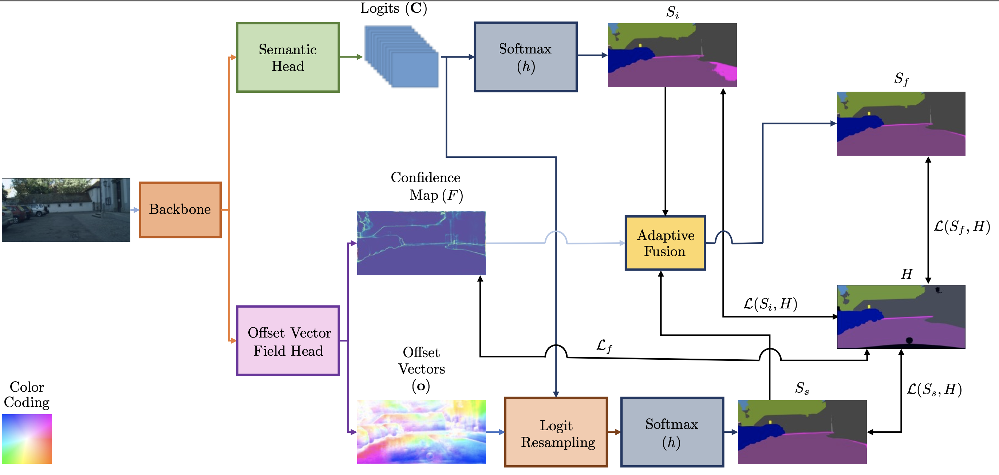

# OVeNet: Offset Vector Network for Semantic Segmentation

Stamatis Alexandropoulos, [Christos Sakaridis (ETH)](https://people.ee.ethz.ch/~csakarid/), [Petros Maragos (NTUA)](https://robotics.ntua.gr/members/maragos/)

Semantic segmentation is a fundamental task in visual scene understanding. We focus on the supervised setting, where ground-truth semantic annotations are available. Based on knowledge about the high regularity of real-world scenes, we propose a method for improving class predictions by learning to selectively exploit information from neighboring pixels. In particular, our method is based on the prior that for each pixel, there is a seed pixel in its close neighborhood sharing the same prediction with the former. Motivated by this prior, we design a novel two-head network, named Offset Vector Network (OVeNet), which generates both standard semantic predictions and a dense 2D offset vector field indicating the offset from each pixel to the respective seed pixel, which is used to compute an alternative, seed-based semantic prediction. The two predictions are adaptively fused at each pixel using a learnt dense confidence map for the predicted offset vector field. We supervise offset vectors indirectly via optimizing the seed-based prediction and via a novel loss on the confidence map. Compared to the baseline state-of-the-art architectures HRNet and HRNet+OCR on which OVeNet is built, the latter achieves significant performance gains on two prominent benchmarks for semantic segmentation, namely Cityscapes, ACDC and ADE20K.

[arXiv](https://arxiv.org/abs/2303.14516) [(pdf)](https://arxiv.org/pdf/2303.14516.pdf)

This is the reference PyTorch implementation for training and evaluation of HRNet using the method described in this paper.

<p align="center">
  
</p>

## License

This software is released under a creative commons [license](LICENSE.txt) which allows for personal and research use only. For a commercial license please contact the authors. You can view a license summary [here](http://creativecommons.org/licenses/by-nc/4.0/).

## OVeNet
<p align="center">
  
</p>

OVeNet consists of two output heads. The first head outputs pixel-level Logits (C), while the second head outputs a dense offset vector field (o) identifying positions of seed pixels along with a confidence map (F). Then, the coefficients of seed pixels are used to predict classes at each position. The resulting prediction (S<sub>s</sub>) is adaptively fused with the initial prediction (S<sub>i</sub>) using the confidence map F to compute the final prediction S<sub>f</sub>


## Contents
1. [Installation](#Installation)
2. [Training](#Training)
3. [Evaluation](#Evaluation)
4. [Citation](#citation)
5. [Contributions](#Contributions)

## Installation

For setup, you need:

1. Linux
2. NVIDIA GPU with CUDA & CuDNN
3. Python 3
4. Conda 
5. PyTorch=1.1.0 following the [official instructions](https://pytorch.org/)
6. Install dependencies: pip install -r requirements.txt


## Data preparation
You need to download the [Cityscapes](https://www.cityscapes-dataset.com/), [ACDC](https://acdc.vision.ee.ethz.ch/) and [ADE20K](http://sceneparsing.csail.mit.edu/)  datasets.

Your directory tree should be look like this:
````bash
$ROOT/data
├── cityscapes
│   ├── gtFine
│   │   ├── test
│   │   ├── train
│   │   └── val
│   └── leftImg8bit
│       ├── test
│       ├── train
│       └── val
├── acdc
│   ├── gt
│   │   ├── fog
│   │   ├── night
│   │   └── rain
│   │   └── snow
│   └── rgb_anon
│   │   ├── fog
│   │   ├── night
│   │   └── rain
│   │   └── snow
├── ade20k
│   ├── train
│   │   ├── image
│   │   └── label
│   └── val
│       ├── image
│       └── label
├── list
│   ├── cityscapes
│   │   ├── test.lst
│   │   ├── trainval.lst
│   │   └── val.lst
│   ├── acdc
│   │   ├── test.lst
│   │   ├── trainval.lst
│   │   └── val.lst
````
### Train and test
Please specify the configuration file.

The models are initialized by the weights pretrained on the ImageNet. You can download the pretrained models from [here](https://github.com/HRNet/HRNet-Image-Classification). All the others pretrained models can be found [here](https://drive.google.com/drive/folders/1haCVit4PmoIIPZiQHVGPbrs_Cqn6xZ6T?usp=sharing).

For example, train the HRNet-W48 on Cityscapes with a batch size of 8 on 4 GPUs:
````bash
python -m torch.distributed.launch --nproc_per_node=4 tools/train.py --cfg  experiments/cityscapes/seg_hrnet_w48_train_ohem_512x1024_sgd_lr1e-2_wd5e-4_bs_12_epoch484_cityscapes_pretrained.yaml
````

For example, evaluating our model on the Cityscapes validation set with multi-scale and flip testing:
````bash
python tools/test.py --cfg experiments/cityscapes/seg_hrnet_w48_train_ohem_512x1024_sgd_lr1e-2_wd5e-4_bs_12_epoch484_cityscapes_pretrained.yaml \
                     TEST.MODEL_FILE output/cityscapes/seg_hrnet_w48_train_ohem_512x1024_sgd_lr1e-2_wd5e-4_bs_12_epoch484_cityscapes_pretrained_base_experiment/final_state.pth \
                     TEST.SCALE_LIST 0.5,0.75,1.0,1.25,1.5,1.75 \
                     TEST.FLIP_TEST True
````
Evaluating our model on the Cityscapes test set with multi-scale and flip testing:
````bash
python tools/test.py --cfg experiments/cityscapes/seg_hrnet_w48_train_ohem_512x1024_sgd_lr1e-2_wd5e-4_bs_12_epoch484_cityscapes_pretrained.yaml \
                     DATASET.TEST_SET list/cityscapes/test.lst \
                     TEST.MODEL_FILE output/cityscapes/seg_hrnet_w48_train_ohem_512x1024_sgd_lr1e-2_wd5e-4_bs_12_epoch484_cityscapes_pretrained_base_experiment/final_state.pth \
                     TEST.SCALE_LIST 0.5,0.75,1.0,1.25,1.5,1.75 \
                     TEST.FLIP_TEST True
````

## Citation

If you find our work useful in your research please use [this](https://arxiv.org/abs/2303.14516) identifier to cite or link to this item.


## Contributions

If you find any bug in the code. Please report to <br>
Stamatis Alexandropoulos (stamatisalex7@gmail.com)
